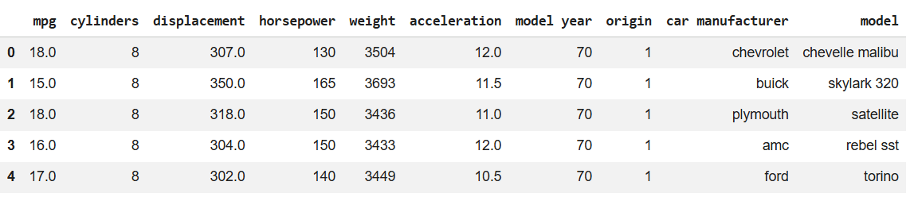
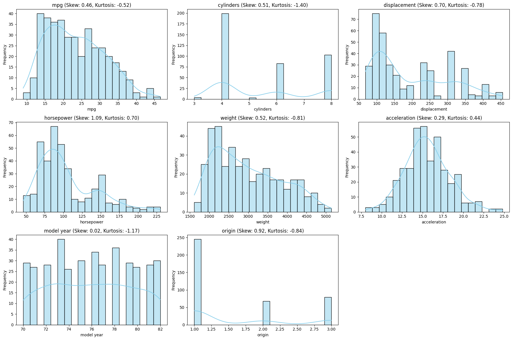
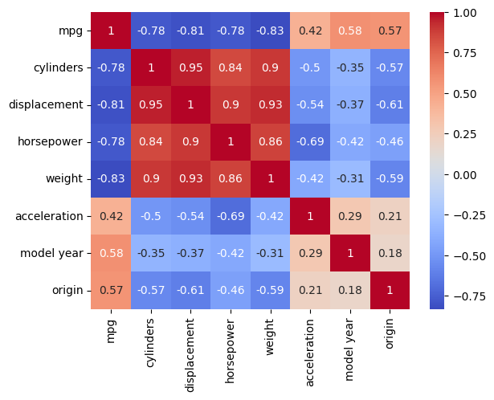
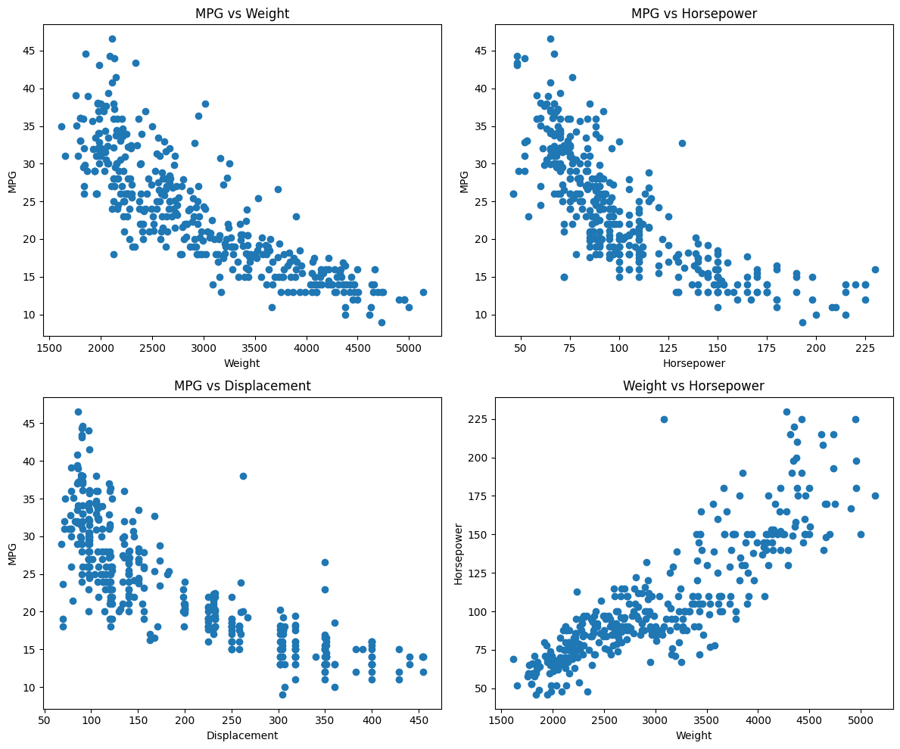

# Unit 2 Seminar Preparation - EDA with auto_mpg dataset

## Aim
EDA was done on the Auto-mpg dataset to:
- Identify missing values.
- Replace categorical values with numerical values (i.e., America 1, Europe 2, etc.).
- Estimate Skewness and Kurtosis.
- Output Correlation Heat Map.
- Output Scatter plot for different parameters.

## Method
The dataset used was the [auto_mpg dataset](Unit02 auto-mpg (1).csv) on Google Colab, using Python.

The shape of the dataset was checked, showin 398 rows and 9 columns. df.info() was used to learn more about the dataset, showing that the 9 columns were mpg, cylinders, displacement, horsepower, weight, acceleration, model year, origin, and car name. mpg, displacement, and acceleration were floats, cylinders, weight, model year, and origin were integers, and horsepower and car names were objects. The dataset used around 28kB of memory.

df.head() was used to get a general idea of what the dataset looked like. 

*Figure 1: Top rows of the dataset.*

This showed that car name contained both the car manufacturer and model. To tidy the dataset, this column was split into 2 values so that the manufacturer and model could be separate and the whole car name was removed from the dataset. Next, all unique car manufacturers were outputted, which showed that there were a lot of mistakes which created duplicate names with wrong spellings. To fix this, all instances with mispellings were replaced with the correct names.

['chevrolet' 'buick' 'plymouth' 'amc' 'ford' 'pontiac' 'dodge' 'toyota' 'datsun' 'volkswagen' 'peugeot' 'audi' 'saab' 'bmw' 'chevy' 'hi' 'mercury' 'opel' 'fiat' 'oldsmobile' 'chrysler' 'mazda' 'volvo' 'renault' 'toyouta' 'maxda' 'honda' 'subaru' 'chevroelt' 'capri' 'vw' 'mercedes-benz' 'cadillac' 'mercedes' 'vokswagen' 'triumph' 'nissan'] - This was the initial list of car manufacturers, which after cleaning the data, turned into the below:
['chevrolet' 'buick' 'plymouth' 'amc' 'ford' 'pontiac' 'dodge' 'toyota' 'datsun' 'volkswagen' 'peugeot' 'audi' 'saab' 'bmw' 'ih' 'mercury' 'opel' 'fiat' 'oldsmobile' 'chrysler' 'mazda' 'volvo' 'renault' 'honda' 'subaru' 'capri' 'mercedes-benz' 'cadillac' 'triumph' 'nissan']

Next, code mapping was introduced to change car manufacturer into an integer. This would simplify further analysis and plotting. Rows were searched to see if they contained any missing values. 2 rows were found containing the car manufacturer subaru with missing models. After searching for similar cars with the same specifications, the models were both changed to dl. No duplicates were found in this dataset. ? was found as a placeholder in several rows. This was turned to NaN and the rows were dropped.

mpg, cylinders, displacement, horsepower, weight, acceleration, model year, and origin were put in a data frame called numeric_cols to calculate skewness and kurtosis. The following was outputted:

Skewness:  
 mpg             0.457092  
cylinders       0.508109  
displacement    0.701669  
horsepower      1.087326  
weight          0.519586  
acceleration    0.291587  
model year      0.019688  
origin          0.915185 
dtype: float64

Kurtosis: 
 mpg            -0.515993  
cylinders      -1.398199  
displacement   -0.778317  
horsepower      0.696947  
weight         -0.809259  
acceleration    0.444234  
model year     -1.167446  
origin         -0.841885  
dtype: float64

The skewness results indicate that most variables are positively skewed, meaning their distributions have longer right tails. Variables such as horsepower (1.09) and origin (0.92) show the strongest right skew, suggesting the presence of higher-value outliers. Other variables like mpg, cylinders, displacement, and weight show moderate positive skew (0.45 - 0.70), while model year (0.02) is apprxoimately symmetrical.

The kurtosis values are mostly negative, indicating platykurtic distributions (flatter than a normal distribution with lighter tails). This is evident for mpg, cylinders, displacement, weight, model year, and origin. However, horsepower (0.70) and acceleration (0.44) show slightly positive kurtosis, suggesting a somewhat more peaked distributions with heavier tails compared to the normal distributions. Overall, the data demonstrates non-normality, particularly due to right skewness in horsepower and origin.

The skewness and kurtosis for all numeric columns were then plotted, as well as a correlation heat map which showed high correlation betweend displaceemnt, cylinders, and horsepower. It also showed low correlation between origin, model year, and acceleration.

*Figure 2: Plots showing kurtosis and skewness for all numeric variables.*

*Figure 3: Correlation heatmap for all numeric variables.*
Finally, scatter plots were outputted to show the relationship between various variables includeing the mpg vs weight, horsepower, and displacement respectively, and showing weight vs horsepower. The miles per gallon show an exponential or curvilinear decrease as weight, horsepower and displacement increase whilst, weight shows an almost linear increase with horsepower. These observed relationships demonstrate that heavier vehicles with higher horsepower and larger engine displacement tend to have lower fuel efficiency. Conversely, as weight increases, horsepower also rises almost linerly, indicating that more powerful cars are generally heavier. These patterns highlight trade-offs between performance and fuel economy that are important for vehicle design.

*Figure 4: Scatter plots showing relationships between MPG, Weight, Horsepower, and Displacement.*

For all the Python code I used, click [here](eda2.py)

## Reflection

Workign with this dataset helped me gain more familiarity with EDA steps and methodology and helped me understand the importance of data cleaning, such as handling missing values, encoding catgeorical variables, and correcting inconsistent entries. Visualisations like scatter plots and correlation heatmaps clairified relationships between different variables. Overall, this exercise reinforced how proper data preparation and exploratory analysis are essential for interpreting patterns and making informed decisions in real-world datasets.

