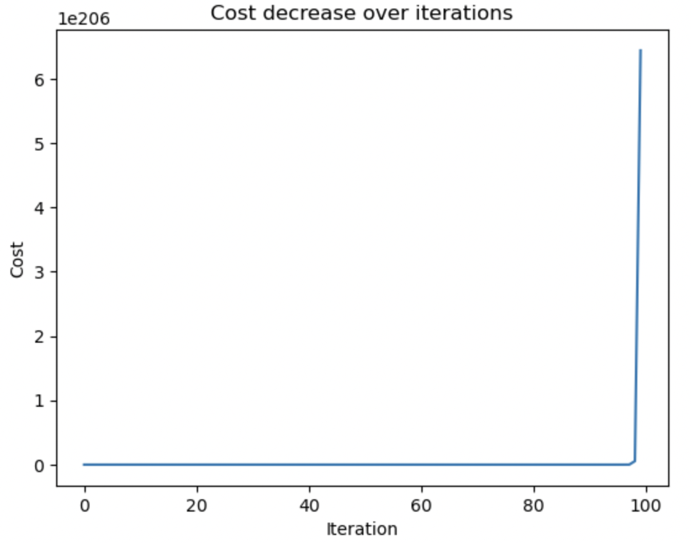
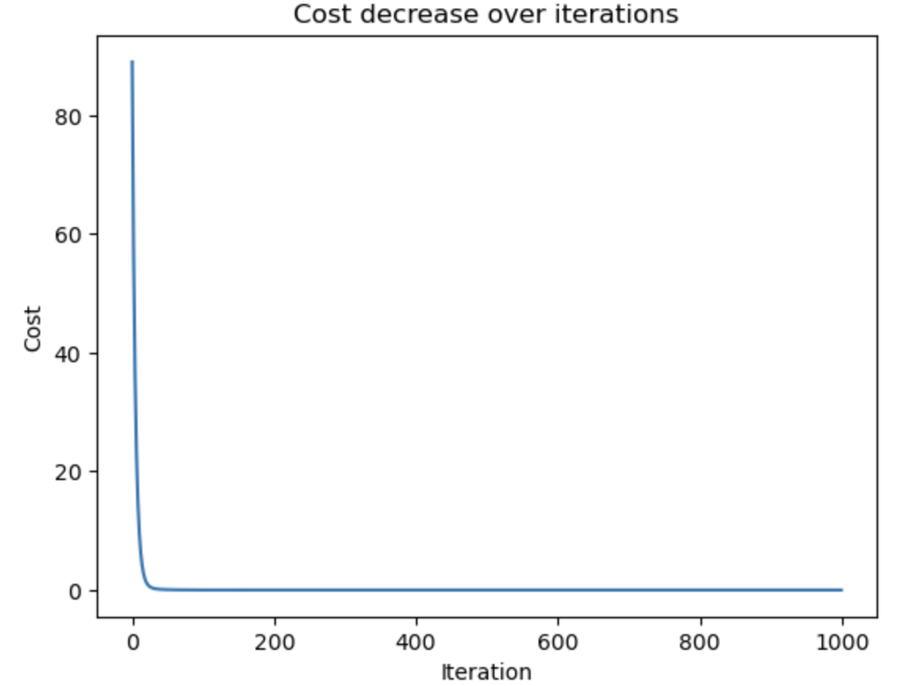
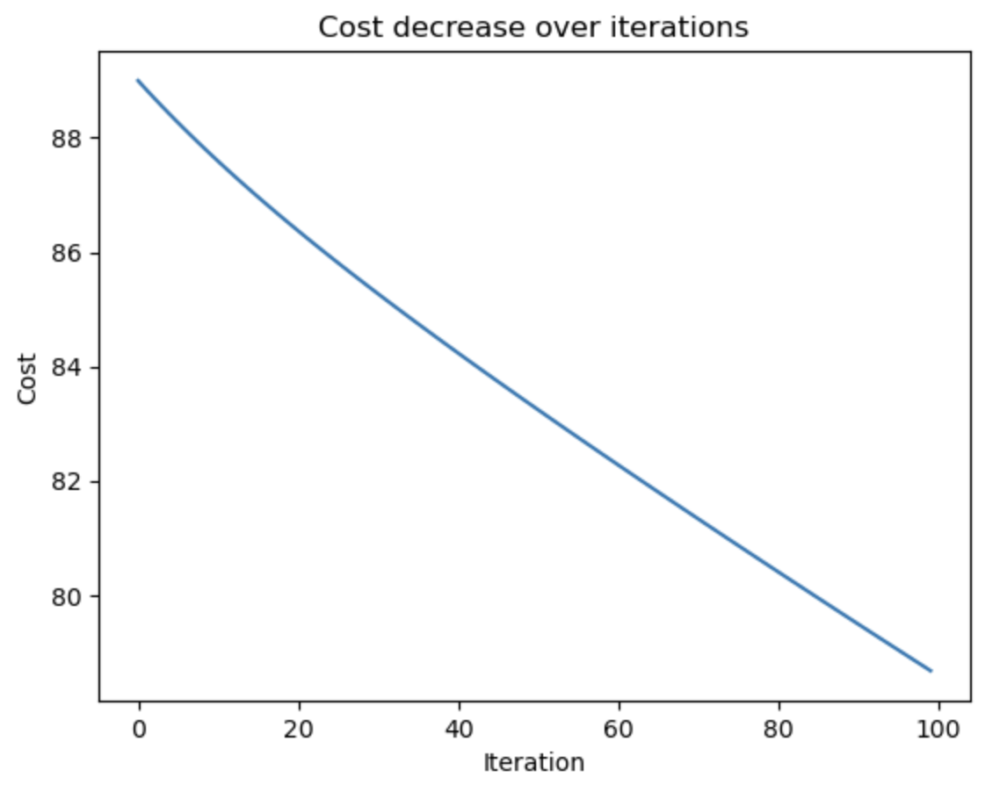
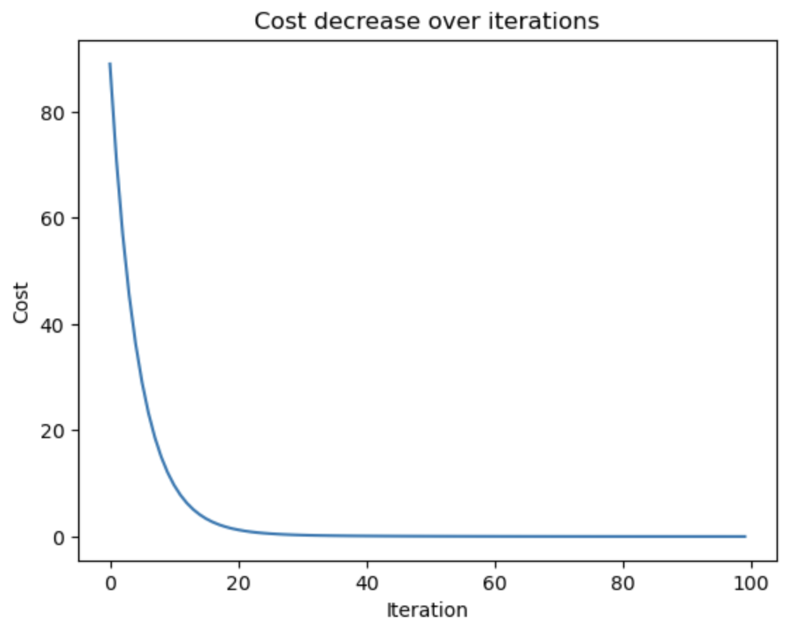

# Gradient Cost Function

The tutorial gradient_descent_cost_function.ipynb was run on Jupyter Notebook. The iteration number and learning_rate were changed to observe how the cost decreased in a simple linear regression model. The gradient descent function was used to fit a line to a small dataset:<br>

```python
x = np.array([1,2,3,4,5])
y = np.array([5,7,9,11,13])
```

The cost function used was the Mean Squared Error (MSE), and I tracked how the cost changed over multiple iterations.<br>

I experimented with different scenarios:<br>
#### 1. Medium iterations with high learning rate (iterations = 100, learning rate = 0.5):<br>
In this case, the algorithm diverged. The values of the slope (m) and the intercept (b) increased dramatically and alternated betweeen positive and negative values. The cost increased rapidly instead of decreasing, showing that the learning rate was too high and caused the algorithm to overshoot the global minimum.<br>

*Figure 1: Line plot showing Cost decrease for medium iterations with high learning rate.*<br>
#### 2. High iterations with low learning rate (iterations = 1000, learning rate = 0.08):<br>
The algorithm converged quickly. The iterations were too high, however the learning rate looked ideal.<br>

*Figure 2: Line plot showing Cost decrease for high iterations with low learning rate.*<br>
#### 3. Medium iterations with low learning rate (iterations = 100, learning rate = 0.0845):<br>
At this learning rate, converged very quickly, causing the cost to stabilise early, appearing almost as a straight line.<br>

*Figure 3: Line plot showing Cost decrease for medium iterations with low learning rate.*

Another experiment was done with iterations = 100 and learning rate = 0.08.<br>
This decreased exponentially, with a rapid drop in early iterations followed by a gradual flattening as the algorithm converges to the minimum around 20 iterations.<br>

*Figure 4: Line plot showing Cost decrease for medium iterations with low learning rate.*


The following code was used to produce the graphs above:<br>
```python
import matplotlib.pyplot as plt

def gradient_descent_plot(x,y):
    m_curr = b_curr = 0
    iterations = #changed each time
    learning_rate = #changed each time
    n = len(x)
    costs = []

    for i in range(iterations):
        y_predicted = m_curr*x + b_curr
        cost = (1/n)*sum((y-y_predicted)**2)
        costs.append(cost)
        md = -(2/n)*sum(x*(y-y_predicted))
        bd = -(2/n)*sum(y-y_predicted)
        m_curr -= learning_rate*md
        b_curr -= learning_rate*bd

    plt.plot(costs)
    plt.xlabel("Iteration")
    plt.ylabel("Cost")
    plt.title("Cost decrease over iterations")
    plt.show()

gradient_descent_plot(x,y)
```
### Reflection
Overall, the experiments highlight the trade-off between learning rate and iterations in gradient descent. While a high learning rate leads to divergence due to overshooting, a well-tuned learning rate enables rapid convergence with minimal iterations. The results also show that for simple datasets, convergence can occur early, making excessive iterations redundant. 

This task helped me gain a practical understanding of how gradient descent works and to understand the importance of tuning parameters depending on one's dataset to improve accuracy and efficiency.

[← Back to Home](https://mmiz02.github.io/portfoliomachinelearning/)
