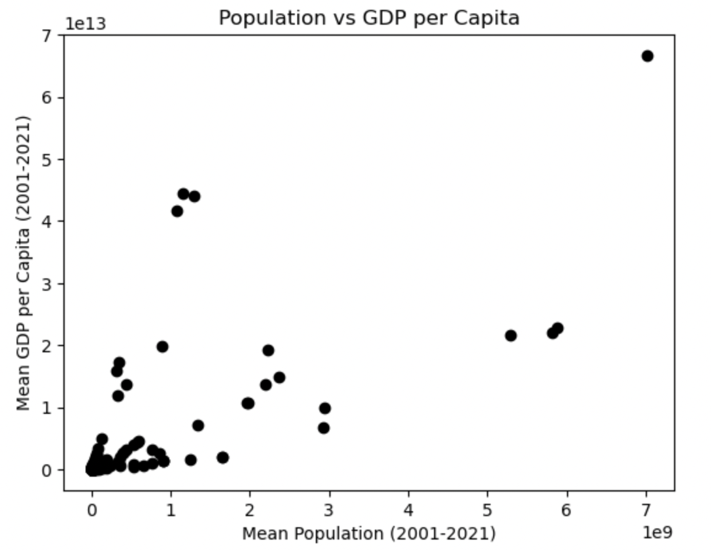
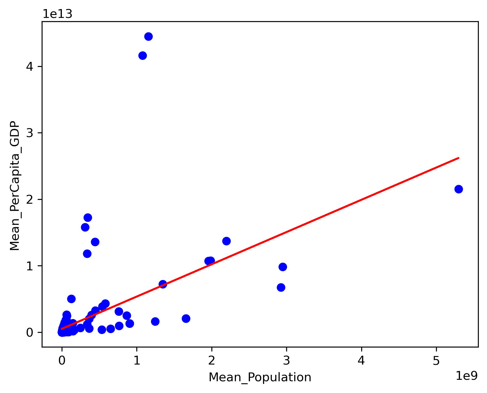

## Seminar 4 Preparation - Linear Regression with Scikit-Learn

For this activity, a demo was first run of the fuel_consumption.ipynb with data from FuelConsumption.csv. After this, data from Global_Population.csv and Global_GDP.csv was used to tackle two tasks by following certain steps from the demo and from previous lectures and readings.

### Task A: Correlation

* Data Preprocessing - Global_Population.csv and Global_GDP.csv were loaded as df and df2, respectively. The year columns (2001-2021 for df and 2001-2020 for df2) were converted to numeric, coercing non-numeric vales to NaN. Missing values in each row were filled with the row mean. Through further exploration, it was noticed that certain rows were fully empty, meaning the row mean was being coputed as NaN. Therefore, the following line was introduced to drop such rows:

clean_df = merged_df.dropna(subset=['Mean_Population', 'Mean_PerCapita_GDP'])

This caused the removal of 10 rows, including small territories, bank clasifications, and other non-standard entries. Dropping these ensured that only valid countries are included in the correlation analysis. Computed Mean_Population and Mean_PerCapita_GDP for each country. The datasets were merged on Country Name.

* Analysis - The scatter plot showed a general upward trend: countries with higher population tend to have a higher GDP per capita, shown in Figure 1. A Pearson correlation coefficient of 0.72 (moderately strong) and p-value ≈  1.85 e-42, confirming statistical significance

*Figure 1: Scatter plot showing mean GDP per capita against mean population.*

* Interpretation - The analysis confirmed a positive association between popoulation size and GDP per capita. Some variability exists but the correlation is statistically significant. The variability may  have also been caused by missing values though this should not be the case since these were mostly accounted for.

### Task B: Regression

A linear regression model was performed to investigate the relationship between the population of each country and the mean per capita GDP. The mean population was set as the independent variable.

# Outputs  
Coefficients: 6457  
Intercept: 2.90e+11  
Mean absolute error: 1.73e+16  
Residual sum of squares (MSE): 2.37e+33  
R2-score: -0.14  

* Observations
The regression coefficients and intercept are extremely large, and R² is negative. This indicates that the model does not fit well when using raw population values. This occurs because population values are very high making the linear model unstable.

The scatter plot (Fig.2) shows the relationship between population and GDP per capita. The regression line attempts to fit the data but does not represent the trend well due to the scale of the independent variable.

*Figure 2: Scatter plot showing mean GDP per capita against mean population with fitted linear regression line.*

* Interpretation
This exercise demonstrated the importance of scaling or transforming variables when working with large numerical data. Future improvements could include using a log-transformed population to improve model interpretability.

### Conclusion

This activity highlighted key learning outcomes:
- Working with global population and GDP data showed how datasets scale, missing values, and outliers can significantly impact machine learning models.
- Handling incomplete or inconsistent data, such as missing values, emphasised the importance of data integrity and ethical reporting when presenting results. Decisions on filtering data must be transparent and justifiable.
- Pre-processing, analysis, and visualisation required systematic problem-solving and workflow, reflecting the need for real-world collaboration in a professional team setting to include clear code, plots, and explanations throughout, to be interpretable by colleagues.

### Code
The code can be found [here]{sem4.ipynb}
