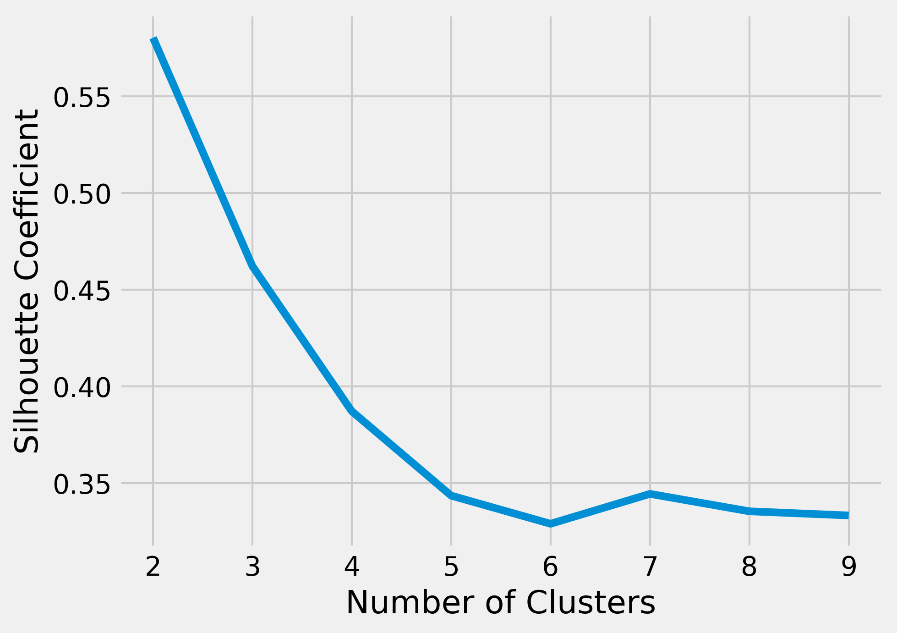

# Unit 6 Seminar Preparation - K-Means Clustering Tutorial

This week, the focus continued on k-means clustering. Preparing for the Seminar 6 lecture, the K-Means demon notebook.ipyb was opened in Jupyter Notebook and  Cust_Segmentation.csv was downloaded from Kaggle. The cells were run to become familiar with how to develop a k-means clustering model. Following the methods utilised, the task below was carried out:

### Task A: Iris data
K-Means clustering was performed on the dataset, iris.csv (from the UCI Machine Learning Repository). 

The following code was used to search for missing values:<br>
```python
cust_df.isnull().any().any()
```

No missing values were found. Before using the data for clustering, the 'species' column was removed because this was a categorical column and because the K-Means algorithm involves the calculation of Euclidian distance. Because of this, the dataset was standardised using *StandardScaler*. The cluster value of K = 3 was chosen, aligning with the known number of species. This was confirmed to be the optimal number of clusters using the elbow method (Fig.1).


*Figure 1: Elbow method plot showing K = 3 is the optimal number of clusters.*

To confirm this, the silhoutte coefficients were computed (Fig.2). This showed that K = 2 was slightly better than K =  3, and whilst this would be better mathematically, after looking through the dataset and seeing that there were 3 different species, it was deemed more accurate to use K = 3.


*Figure 2: Silhouette coefficients plotted, showing K = 2 is the optimal number of clusters.*

Upon clustering at K = 3, the similarity of clusters to the actual species labels (setosa, versicolour, and verginica) was computed.

| species  Clus_km | setosa | versicolor | virginica |
|------------------|--------|------------|-----------|
| 0                | 50     | 0          | 0         |
| 1                | 0      | 39         | 14        |
| 2                | 0      | 11         | 36        |

- Cluster 0: Perfectly captured setosa (50), meaning K-Means correctly identified this species. <br>
- Cluster 1: Mostly versicolor (39) with some virginica (14), meaning K-Means mixed these two species.<br>
- Cluster 2: Mostly virginica (36) with some versicolor (11), meaning K-Means mixed these two species.<br>

Confirming this, a scatter plot was created, where the clusters were coloured differently, the markers' sizes were proportional to their septal_width, and petal_width against petal_length was plotted (Fig.3). This shows that one cluster is being wellseparated but that clusters 1 and 2 have some overlap.


*Figure 3: Scatter plot of Iris data showing 3 different clusters.*

### Code
The code used for this task may be viewed [here](sem6.ipynb).

### Reflection
- Performing clustering requires careful attention not only to mathematical  methods but also to the dataset itself. Misinterpretation of clusters could lead to incorrect conclusions or bias.
- This task highlighted the challenges of using K-Means with mixed-type datsets. The categorical column 'species' could not be directly included and had to be removed, and standardising numeric features was necessary. This emphasises the need for data preprocessing. Additionally, visualisations helped assess the applicability of K-Means for this particular dataset.
- Following a structured notebook and documenting each step improved workflow, reflecting real-world, collaborative environments.

