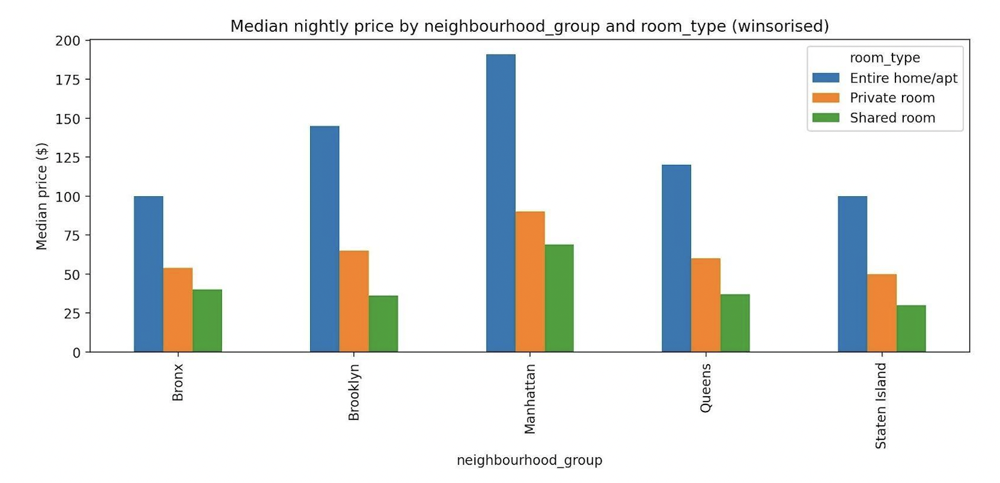
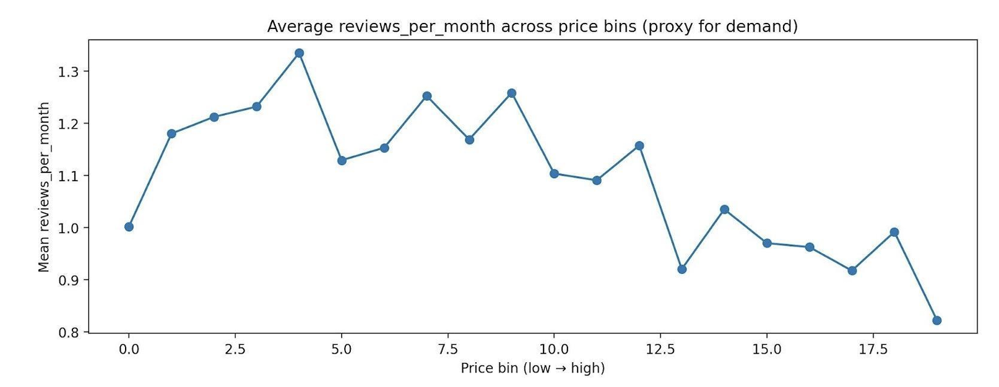

# Team Project: Airbnb Business Analysis Data Science

### Project Overview
This team project focused on analysing Airbnb listings in New York City using a classical machine learning approach (Track 1: Regression and Clustering). The objective was to apply data science techniques to a real-world business problem and generate actionable pricing insights for Airbnb hosts.

The researcg question our team came up with was:  
What is the optimal price range per neighbourhood_group × room_type segment that maximises booking possibility while preserving competitive host earnings? 

We used the AB_NYC_2019 dataset (Dgomonov, 2019), which includes listing information such as price, location, availability, room type, etc. Since actual booking data was not available we used reviews per month as a proxy for demand.

### Data Preparation
We began by cleaning and preparing the dataset to ensure reliable analysis including: 
- Removing invalid or missing price values 
- Winsorising extreme price outliers to reduce distortion 
- Handling missing review data by imputing zero values 
- Applying log transformations to price to address skewness 

Exploratory analydid was done to understand how pricing varies across boroughs and room types. This revealed strong structural differences, particularly between Manhattan and outer boroughs, as well as between entire homes, entire rooms, and shared rooms. This is shown in Figure 1 below.

### Machine Learning Approach
We applied multiple classical machine learning techniques:

#### Regression Models
We trained Ridge Regression and Random Forest models to predict price based on features such as location, room type, etc.

*Figure 1: Room Type and neighbourhood group median nightly price (winsorised)*

The Random Forest model performed better than the Ridge model with lower error (RMSE ~ 0.42 in log scale). Using this model, the top drivers of the model were depicted in Figure 2. Again, room or home type was shown as being the main price driver.

*Figure 2: The main top 20 price drivers – Importance of Random Forest feature*

#### Clustering (K-Means)
We used K-Means clustering to segment listings into distinct market groups. Optimal *k = 8* was deducted based on silhouette scores. Clear segments were identified ranging from budget listings to premium listings.

#### Demand modelling
We used Logistic Regression to estimate the probability of high demand, defined using review per month witin each segment.

This allowed us to combine: 
Expected Value = Price x Probability og High Demand

### Pricing Strategy and Business Insights
We developed a pricing frameork that balanced:
- Booking probability 
- Expected revenue 
- Market segment characteristics 

This produced three pricing strategies:
- Booking-maximising price 
- Revenue-maximising price 
- Compromise price 

Overall, results showed that mid-range pricing often achieved the best balance between demand and earnings (Fig. 3), and that pricing must be tailored by both neighbourhood and room type.

*Figure 3: Monthly Average Reviews Throughout Price Bins (Demand Proxy)*

### Key Findings
Location and room type are the strongest pricing determinans and demand follows a non-linear relationship with price. Figure 4 also confirms that the market can be meaningfully segmented into distinct clusters.

*Figure 4: Neighbourhood group × room type recommended compromise price*

Through this project, we can confirm that using data to drive pricing can improve both occupancy and revenue outcomes.

### Team Working and Process Reflection

The teamwork was kickstarted by an individual that asked everyone for their preferred email and contact method and prepared a shared Google Drive. From here, we had an online Zoom meeting where we decided that we would divide ourselves depending on who would work on the code and who would work on the report. The agenda for the first meeting can be viewed [here](agenda.docx).

We then booked another meeting where we would decide on the research question. In the second meeting, we decided between various research [questions](ideas.docx) on the best one. We also divided ourselves into 2 groups where 3 of us worked on the code and the others worked on the report. Personally, I worked on the report, where I developed the executive summary and the methodology. I also proof-read once the report was finished. Python was used to produce the diagrams and to carry out Track 1 (classical machine learning), and the code used can be found [here](code.py) and all the outputs can be found [here](outputs.zip). The data pre-processing steps can be found [here](task2.docx), even though more was added along the way but this was the initial idea. 

While the code and report were being written, we used Google Docs to collaborate and had everything shared on our Google Drive. To communicate, we mainly used Whatsapp since we did not find the need to have another meeting and our free time did not align easily with each other.

Overall, all individuals collaborated as a team and everyone was more than happy to do their part. One minor issue was that 2 individuals did most of the coding so the other individual ended up not really contributing. He then attempted to draw up an appendix to add to the report, however the group consensus was that the appendix was not needed.

### Challenges and Limitations

- There was some missing data,
- The use of reviews as a proxy for demand,
- Did not take into account the proximity to landmarks or transport, only took into condieration the neighborhood.
- Data was from 2019 so did not capture trends over time,
- Feature limitations - no photos or information of amenities was included,
- K-means assumes spherical clusters and may not capture complex strutures,
- Missing numerical features were imputed using the median and standardised whilst missing categorical features were imputed using the most frequenct value and encoded using one-hot encoding. This may have affected the accuracy.

### Lecturer feedback an Improvements

The feedback highlighted that the project was well-exeuted overall, particularly in terms of technical implementation. The machine learning methodology was identified as a key strength, demonstrating a strong understanding of regression, clustering, and data preprocessing techniques. Visualisations and report structure were also positively received, with clear communication suitabel for a business audience.

However,several areas for improvement were identified. Firstly, while the business question was relevant and well-justified, it could have been expanded to consider broader strategic implications. Similarly, the final recommendation could have been better linked to the analytical results.

From a technical perspective, the rationale regarding why that particular algorithm was chosen could have been better justified. Additionally, the report would have benefitted from clearer presentation of model diagnostics (e.g. performance metrics in tabular form) alongisd brief intepretation.

Another key limitation was the absence of a Python appendix. No snippet codes were included in the report either. This was due to a miscommunication between the group where most of the team though that the Python was being uploaded separately. This should have been clarified between us before submission. This reduced reproducibility and transparency.

### Reflection and Future Improvements

In future work, greater emphasis wuld be placed on explicitly linking insights to business recommendations to strengthen decision-making relevance. I would also justify model selection more critically by comparing alternative algorithms and inlcuding evaluation summaries. Moreover, I would incorporate more advanced visualisations, as the lecturer feedback said, such as GIS-based mapping. 

Finally, I would ensure that all submission requirements are fully met, including adequate code addition.

### Evaluation after carrying out Unit 11 Project

Unit 6 focues on classical machine learning approach to structured data, uing regression and clustering to generate interpretable pricing and segmentation insights. The emphasis was on business applicability, feature relationships, and clear decision-mkaing outputs.

On the other hand, Unit 11 used deep elarning technique, specificallt CNNs and transfer learning, on image data. This required more complex model design, computer power, hyperparameter tuning, and a focus on performance and generalisation rather than interpretability. A key difference was the data type used. Unit 6 dealt with tabular data with explicit features, while Unit 11 required automatic feature extraction fromlow resolution images. As a result, Unit 6 produced more directly actionable insights, whereas Unit 11 focused on model performance and architectural comparison.

Overall, Unit 6 developed core machine learning and business analytical skills, while Unit 11 expanded technical capability into deep learning.

[← Back to Home](https://mmiz02.github.io/portfoliomachinelearning/)

